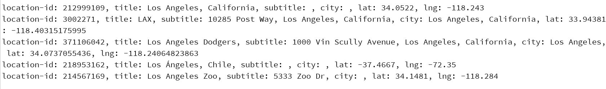

Instagram Scraper
=================

instagram-scraper is a command-line application written in Python that scrapes and downloads an instagram user's photos and videos. Use responsibly.

Some details:

1. The program is used for scraping a given location instagram metadata happening recently, as people are posting continuously.
  
However, when it keeps retrieving, it starts to get older ones as time goes, this can be seen by the name and timestamp of each file
  
Few new posts posted after the start of scraping are scraped.

2. It is stored in json format, with 100 posts per file, the file name was named as "year/month/day/hour"

3. Duplicates might occur, if the program was stopped and restarted very frequently, it could be avoided by adding "--latest", but this could cause all posts newly scraped are more recent than the old ones.

If the dataset is massive enough, then duplicates should be checked, within the file that store posts in the same hour.

4. Instagram currently does not provide api for scraping followers, working on scraping from webpages and constructing graphs.

To represent and analyze large graphs, neo4j is a tentative tool.


Install
-------

Clone the project and run the following command to install(With Python 3.7.0b2):
Make sure you cd into the *CusInscraper-master* folder before performing the command below.
```
$ python setup.py install
```


Usage
-----
It is always necessary to provide your username and password if you want to use the scraper.
Of course it is okay to use some throwaway acounts.

To get an id from location name(Usally big cities come first in returning result of id):
```bash
$ instagram-scraper -u [your username] -p [your password] --search-location [location name]
```
For instance, you want to know location-id in los angeles 
```bash
$ instagram-scraper -u [your username] -p [your password] --search-location los angeles        
```
The query result should be:


To scrape data from a given location id:
```bash
$ instagram-scraper -u [your username] -p [your password] --location [target location id] --me
dia-types none --media-metadata -m [maximum number to scrap] --retry-forver
(--comments might be added for)             
```
For instance, you want to scrap 1000000 posts from los angels,but only want to fetch metadata with comments and locations
```bash
$ instagram-scraper -u [your username] -p [your password] --location 212999109 --media-types none --comments --include-location -m 1000000 --retry-forever        
```

*By default, downloaded media will be placed in `<current working directory>/<location-id>`.The data will be stored per hour per day*

Breakpoint Recover
------------------
1. Save the following shell code as xxx.sh(Before that, change the instagram-scraper to your own path that has that installed instagram-scraper), the shell script will restart the program when the program carshes(exit code not 0), the endcursor.txt has the breakpoint to inform the program where to restart.
```bash
#!/bin/bash
until ./anaconda3/bin/instagram-scraper -u [Username] -p [Password] --location 212999109 --media-types none --media-metadata -m 24000000; do
  echo "Instagram-scraper crashed with exit code $?.  Respawning.." >&2
  sleep 1
done
```
2. Change access permisssion, run the following in console
```bash
chmod +x xxx.sh
```
3. Go to crontab  
```bash
crontab -e
```
Add the text and save file,this will enable the shell script when system is rebooted
```
@reboot /path/to/shell/xxx.sh
```

4. Run the shell script ./xxx.sh 
```bash
nohup ./xxx.sh &
```

OPTIONS
-------

```
--help -h           Show help message and exit.

--login-user  -u    Instagram login user.

--login-pass  -p    Instagram login password.

--filename    -f    Path to a file containing a list of users to scrape.

--destination -d    Specify the download destination. By default, media will 
                    be downloaded to <current working directory>/<username>.

--retain-username -n  Creates a username subdirectory when the destination flag is
                      set.

--media-types -t    Specify media types to scrape. Enter as space separated values. 
                    Valid values are image, video, story (story-image & story-video),
                    or none. Stories require a --login-user and --login-pass to be defined.

--latest            Scrape only new media since the last scrape. Uses the last modified
                    time of the latest media item in the destination directory to compare.

--latest-stamps     Specify a file to save the timestamps of latest media scraped by user.
                    This works similarly to `--latest` except the file specified by
                    `--latest-stamps` will store the last modified time instead of using 
                    timestamps of media items in the destination directory. 
                    This allows the destination directories to be emptied whilst 
                    still maintaining history.

--quiet       -q    Be quiet while scraping.

--maximum     -m    Maximum number of items to scrape.

--media-metadata    Saves the media metadata associated with the user's posts to 
                    <destination>/<username>.json. Can be combined with --media-types none
                    to only fetch the metadata without downloading the media.

--include-location  Includes location metadata when saving media metadata. 
                    Implicitly includes --media-metadata.

--comments          Saves the comment metadata associated with the posts to 
                    <destination>/<username>.json. Implicitly includes --media-metadata.
                    
--interactive -i    Enables interactive login challenge solving. Has 2 modes: SMS and Email

--retry-forever     Retry download attempts endlessly when errors are received

--tag               Scrapes the specified hashtag for media.

--filter            Scrapes the specified hashtag within a user's media.

--location          Scrapes the specified instagram location-id for media.

--search-location   Search for a location by name. Useful for determining the location-id of 
                    a specific place.
                    
--template -T       Customize and format each file's name.
                    Default: {urlname}
                    Options:
                    {username}: Scraped user
                    {shortcode}: Post shortcode (profile_pic and story are empty)
                    {urlname}: Original file name from url.
                    {mediatype}: The type of media being downloaded.
                    {datetime}: Date and time of upload. (Format: 20180101 01h01m01s)
                    {date}: Date of upload. (Format: 20180101)
                    {year}: Year of uplaod. (Format: 2018)
                    {month}: Month of upload. (Format: 01-12)
                    {day}: Day of upload. (Format: 01-31)
                    {h}: Hour of upload. (Format: 00-23h)
                    {m}: Minute of upload. (Format: 00-59m)
                    {s}: Second of upload. (Format: 00-59s)
                    
                    If the template is invalid, it will revert to the default.
                    Does not work with --tag and --location.
```

Develop
-------

Clone the repo and create a virtualenv 
```bash
$ virtualenv venv
$ source venv/bin/activate
$ python setup.py develop
```

Running Tests
-------------

```bash
$ python setup.py test

# or just 

$ nosetests
```

